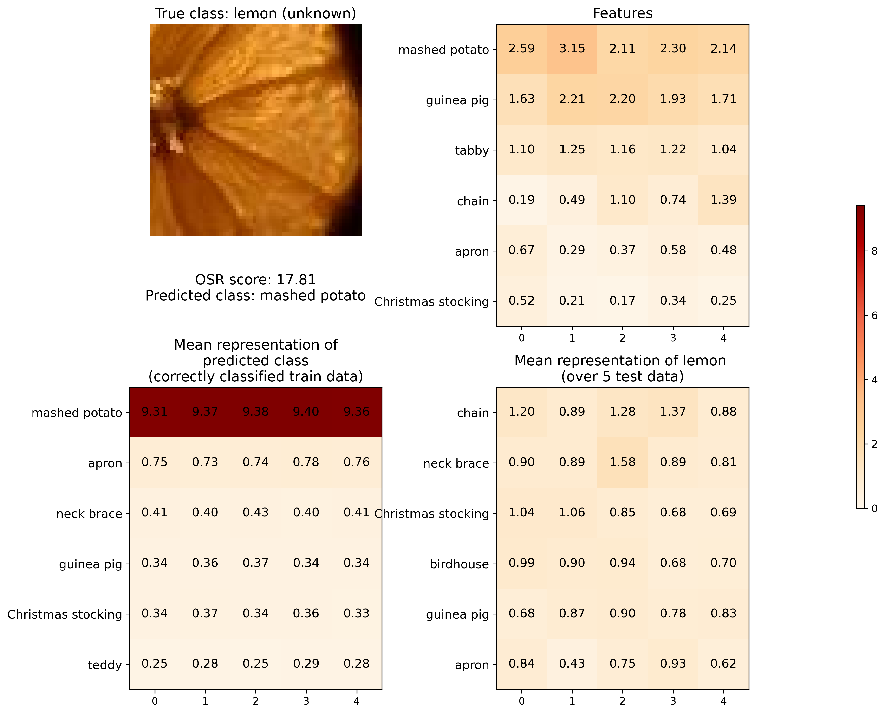

# Representation analysis

## Contents
[1. Introduction](#intro)

[2. Observations](#observations)

[3. Image cards](#img_cards)

&nbsp;&nbsp;&nbsp;&nbsp;[3.1. Known images](#known_imgs)

&nbsp;&nbsp;&nbsp;&nbsp;[3.2. Unknown images](#unknown_images)

## <a name="intro"></a> 1. Introduction

We present additional results supporting those presented in Section 5 of the article. The extracted representations come from a model trained on split 0 of TinyImageNet. Know classes are :
```
jinrikisha  -  beach wagon  -  guinea pig  -  pay-phone  -  gondola  
Christmas stocking  -  birdhouse  -  teddy  -  tractor  -  mashed potato
apron  -  brown bear  -  neck brace  -  chain  -  lesser panda
binoculars  -  trolleybus  -  tabby  -  reel  -  barn
```
While all other classes of TinyImageNet are considered as unknown.

If we would like to have a detection of 90% of unknown images, we need to choose a threshold of 9.85 on the distance to the closest anchor (which is our OSR score). Therefore, in the following visualizations, if a prediction have an OSR score higher than 9.85 it can be considered as rejected by the model. With such a threshold, 53.80% of knowns are detected as unknowns (i.e rejected). The accuracy on the remaining known accepted classes is 98%.

We show below, for a few images, ``cards'' containing :
- The input image.
- The OSR score.
- The predicted class.
- The representation learned by the model for this image (top right).
- The mean representation of the predicted class, computed on the correctly classified train data (bottom left), for comparison with the representation of the input image.
- The mean representation of all images of the true class, computed on the test set (bottom right). Note that, since there are 180 unknown classes, and that following Vaze et al. (2022), we equalized the number of known and unknown instances, there are only around 5 images per class in the unknown test set (at least one and at most 12 due to random selection).

**Note** that only the top 6 most activated classes (according to the sum of class features) are displayed in the representations for better visualization.

<!-- **Note** : more images can be found in the `known_images` and `unknown_images` folders. -->

## <a name="observations"></a> 2. Observations

It can be seen on images below that, in general, all features of the same class are activated, which is expected for known classes, since the characteristics represented by those features can be present in the input image. However, this behavior is also observed for unknown classes, which is not expected. Unknown classes could share some characteristics with known classes but not all of them, and should even less activate all characteristics of multiple known classes. This signifies that either the model did not learn relevant features for known classes, or that it learned to activate all features of classes, in order to validate more easily the optimization objective.

## <a name="img_cards"></a> 3. Image cards

### <a name="known_imgs"></a> 3.1. Known images


---

---

---

---

---

---

---


### <a name="unknown_images"></a> 3.2. Unknown images

Considering an arbitrary threshold of 1 on features to have an activation, otherwise it can be noise, then there are all features of multiple classes that are activated by unknown images.


---

---

---

---

---

---

---

---

---

#### About the mean representations

For unknown images, the mean representation of images of the true class (bottom right) display low values in average for some unknown classes even though the image representation above contains high values. This is due to the fact that each image is activating features of different classes. For example for the cockroach class, the representations of the 6 images are displayed below (top 6 of most activated features). 

|  |  |
|----------|----------|
|     |     |   
  |   |
|     |     |